# Visualisasi Memmori

## ASCII Diagram 1 : Stcak Frame Layout

```text
SKENARIO: Fungsi main() memanggil foo(), foo() memanggil bar()

STACK (tumbuh ke bawah ↓)                   ALAMAT MEMORI (contoh 64-bit)
─────────────────────────────────────────────────────────────────────────
│ main() frame                             │  0x7FFF_FFFF_F000  ← top of stack
│  ┌──────────────────────────────────┐    │
│  │ return address                   │    │  0x7FFF_FFFF_EFF8
│  │ (alamat instruksi setelah call)  │    │
│  ├──────────────────────────────────┤    │
│  │ const gpa: GPA = ...     [48 B]  │    │  0x7FFF_FFFF_EFD0
│  ├──────────────────────────────────┤    │
│  │ const config: Config     [10 B]  │    │  0x7FFF_FFFF_EFC6
│  │   .port         [u16]    [2  B]  │    │  (aligned ke 2)
│  │   .max_conn     [u32]    [4  B]  │    │  (aligned ke 4)
│  │   .debug_mode   [bool]   [1  B]  │    │
│  │   [padding]              [3  B]  │    │  ← alignment padding!
│  └──────────────────────────────────┘    │
│                                          │
│ foo() frame                              │
│  ┌──────────────────────────────────┐    │
│  │ return address                   │    │  0x7FFF_FFFF_EF80
│  ├──────────────────────────────────┤    │
│  │ var x: u32 = 42          [4  B]  │    │  0x7FFF_FFFF_EF7C
│  │ var y: f64 = 3.14        [8  B]  │    │  0x7FFF_FFFF_EF74 (aligned ke 8)
│  └──────────────────────────────────┘    │
│                                          │
│ bar() frame                              │
│  ┌──────────────────────────────────┐    │
│  │ return address                   │    │  0x7FFF_FFFF_EF40
│  ├──────────────────────────────────┤    │
│  │ var buf: [8]u8 = undefined[8 B]  │    │  0x7FFF_FFFF_EF38
│  └──────────────────────────────────┘    │
│                                          │
▼ (stack tumbuh ke arah alamat rendah)     │  0x7FFF_FFFF_0000
```

## ASCII Diagram 2: Heap vs Stack — Pointer Relationship
```text
KODE:
  var gpa = std.heap.GeneralPurposeAllocator(.{}){};
  const allocator = gpa.allocator();
  const slice = try allocator.alloc(u8, 1024);
  defer allocator.free(slice);

MEMORI:

  STACK                            HEAP
   ──────────────────────           ──────────────────────────────────
  │ slice variable       │         │
  │  ┌────────────────┐  │         │  0x0000_0001_5000_0000
  │  │ .ptr: *u8      │──┼────────►│  ┌─────────────────────────┐
  │  │ = 0x150000000  │  │         │  │ [0x00] │ [0x01] │ ...   │
  │  ├────────────────┤  │         │  │  0x00  │  0x00  │ ...   │
  │  │ .len: usize    │  │         │  │ ← 1024 bytes alokasi →  │
  │  │ = 1024         │  │         │  └─────────────────────────┘
  │  └────────────────┘  │         │  (dikelola oleh GPA internaly)
  │                      │         │
  │  CATATAN: 'slice'    │         │  HEADER alokasi (disembunyikan GPA):
  │  adalah FAT POINTER: │         │  ┌────────────────────────────┐
  │  { ptr, len }        │         │  │ size: 1024                 │
  │  = 16 byte di stack  │         │  │ align: 1                   │
  │                      │         │  │ next_free_chunk: ...       │
  └──────────────────────┘         │  └────────────────────────────┘
                                   │
  SETELAH defer allocator.free():  │
  ─────────────────────────────    │  Memory dikembalikan ke GPA
  slice.ptr → DANGLING (jangan     │  (BUKAN ke OS — GPA cache-nya)
  diakses!)                        │
```

## ASCII Diagram 3: Alignment dan Padding di Struct

```text
KODE:
  const Buruk = struct {
      a: u8,    // 1 byte
      b: u64,   // 8 byte — harus aligned ke 8!
      c: u16,   // 2 byte
      d: u32,   // 4 byte — harus aligned ke 4!
  };

  const Bagus = struct {
      b: u64,   // 8 byte
      d: u32,   // 4 byte
      c: u16,   // 2 byte
      a: u8,    // 1 byte
      // tidak ada padding!
  };

LAYOUT di MEMORI:

Struct Buruk (total: 24 byte — boros!):
┌──────┬───────────────────────┬────────┬─────┬────┬───┐
│ a    │ PADDING               │ b      │ c   │ PAD│ d │
│ 1B   │ 7 byte padding!       │ 8 byte │ 2B  │ 2B │ 4B│
└──────┴───────────────────────┴────────┴─────┴────┴───┘
offset: 0      1               8        16   18  20

Struct Bagus (total: 15 byte, size efektif 16 byte setelah struct align):
┌──────────────────┬──────────┬───────┬──────┐
│ b                │ d        │ c     │ a    │
│ 8 byte           │ 4 byte   │ 2 byte│ 1 B  │
└──────────────────┴──────────┴───────┴──────┘
offset: 0          8          12      14

ATURAN: letakkan field TERBESAR dulu untuk minimalkan padding.
Zig TIDAK secara otomatis mereorder field (berbeda dengan Rust).
Gunakan @sizeOf(T) dan @offsetOf(T, "field") untuk verifikasi!
```

## ASCII Diagram 4: Error Union di Memori

```text
REPRESENTASI MEMORI dari: fn foo() !u32

Error Union '!u32' di memori:
┌─────────────────────────────────────────┐
│  TAG (u16) │  PAYLOAD                   │
│            │                            │
│  0x0000    │  [u32 value]               │  ← kasus OK (nilai u32)
│  (no error)│                            │
│            │                            │
│  0x0001    │  [error code]              │  ← kasus Error
│  (has err) │  (OutOfMemory = 1, dll)    │
└─────────────────────────────────────────┘
Total: max(sizeof(tag) + max(sizeof(OK), sizeof(Err)))

Di zig: @sizeOf(!u32) = 8  (4 byte value + 2 byte tag + 2 byte padding)

BERBEDA dengan C yang sering menggunakan:
  int errno;  ← global mutable state! (BURUK untuk concurrent code)
  return -1;  ← nilai ajaib yang harus Anda tahu artinya
```

## Visual interaktif dari layout memori stack dan heap di bawah ini:


---

<div align="center">
  <a href="https://github.com/gh0st4n">Gh0sT4n</a> -
  <a href="https://t4n-labs.github.io/t4n-os">T4n OS</a> -
  <a href="https://ziglang.org/documentation/0.16.0">Zig 0.16.0</a>

  <br><br>

  <a href="/02-ImplementasiKode.md">&lt;- Previously</a> |
  <a href="./04-TugasPraktik.md">Next -&gt;</a>
</div>